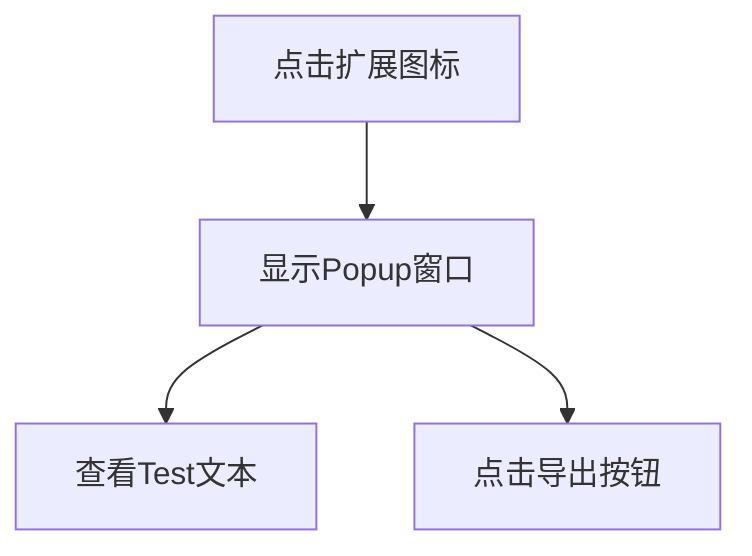

# Chrome扩展程序产品需求文档

## 1. Product Overview
一个简单的Google Chrome浏览器扩展程序，以小弹窗（Popup）形式提供基础的文本显示和导出功能入口。
该扩展程序主要用于为用户提供快速访问的工具界面，当前版本专注于界面展示和基础交互。

## 2. Core Features

### 2.1 Feature Module
我们的Chrome扩展程序包含以下主要页面：
1. **Popup页面**：文本显示区域、导出按钮

### 2.2 Page Details

| Page Name | Module Name | Feature description |
|-----------|-------------|---------------------|
| Popup页面 | 文本显示区 | 显示固定文本"Test"，提供清晰的文字展示 |
| Popup页面 | 导出按钮 | 提供导出功能的触发按钮，当前仅作为界面元素存在 |

## 3. Core Process
用户点击浏览器工具栏中的扩展程序图标，弹出popup窗口，用户可以看到"Test"文本和导出按钮。用户可以点击导出按钮（当前版本无实际功能）。

## 4. User Interface Design
### 4.1 Design Style
- 主色调：#4285f4（Google蓝）
- 次要颜色：#ffffff（白色背景）
- 按钮样式：圆角矩形，现代扁平化设计
- 字体：系统默认字体，14px主要文本
- 布局风格：简洁的垂直布局，居中对齐
- 图标风格：简洁的线性图标

### 4.2 Page Design Overview

| Page Name | Module Name | UI Elements |
|-----------|-------------|-------------|
| Popup页面 | 文本显示区 | 居中显示的"Test"文本，字体大小16px，颜色#333333 |
| Popup页面 | 导出按钮 | 蓝色背景按钮，白色文字，圆角4px，宽度120px，高度36px |

### 4.3 Responsiveness
该扩展程序为固定尺寸的popup窗口，尺寸约为300x200像素，无需响应式设计。