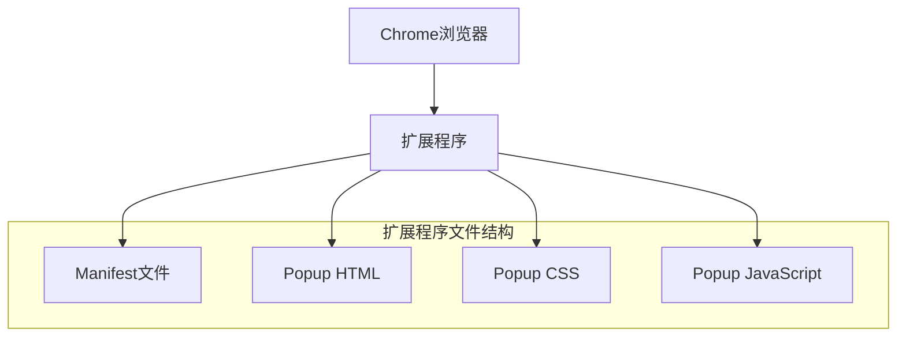

# Chrome扩展程序技术架构文档

## 1. Architecture design



## 2. Technology Description
- Frontend: HTML5 + CSS3 + Vanilla JavaScript
- 扩展程序框架: Chrome Extension Manifest V3
- 无需后端服务

## 3. Route definitions

| Route | Purpose |
|-------|---------|
| popup.html | 扩展程序弹窗页面，显示主要界面内容 |

## 4. 扩展程序文件结构

### 4.1 核心文件

**manifest.json** - 扩展程序配置文件
```json
{
  "manifest_version": 3,
  "name": "Test Extension",
  "version": "1.0",
  "description": "A simple Chrome extension with popup",
  "action": {
    "default_popup": "popup.html",
    "default_title": "Test Extension"
  },
  "permissions": []
}
```

**popup.html** - 弹窗页面结构
```html
<!DOCTYPE html>
<html>
<head>
  <meta charset="utf-8">
  <style>
    body { width: 300px; height: 200px; }
  </style>
  <link rel="stylesheet" href="popup.css">
</head>
<body>
  <div class="container">
    <div class="text-display">Test</div>
    <button class="export-btn">导出</button>
  </div>
  <script src="popup.js"></script>
</body>
</html>
```

## 5. 样式设计

**popup.css** - 样式定义
- 容器居中布局
- 文本显示区样式：字体16px，颜色#333333
- 按钮样式：蓝色背景#4285f4，白色文字，圆角4px
- 整体尺寸：300x200像素

## 6. 交互逻辑

**popup.js** - JavaScript交互
- 监听导出按钮点击事件
- 当前版本仅显示提示信息，无实际导出功能
- 基础的DOM操作和事件处理

## 7. 部署说明

1. 将所有文件放置在同一目录下
2. 打开Chrome浏览器，进入扩展程序管理页面
3. 开启开发者模式
4. 点击"加载已解压的扩展程序"
5. 选择包含manifest.json的文件夹
6. 扩展程序将出现在浏览器工具栏中